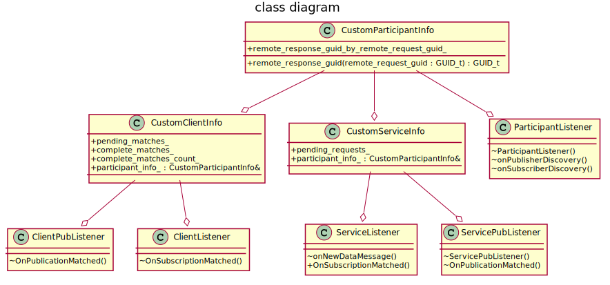
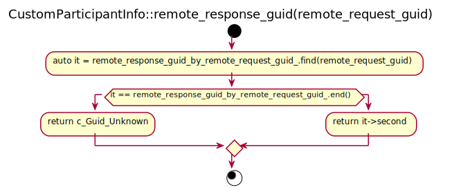
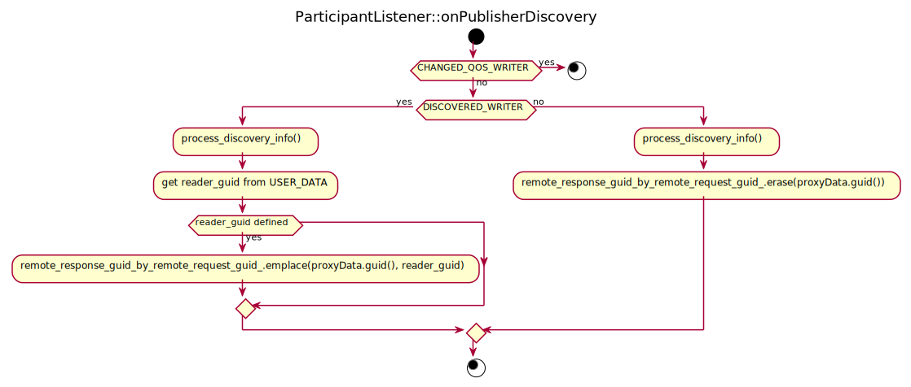
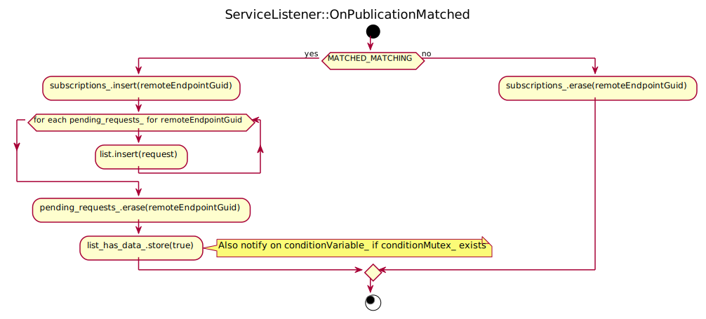
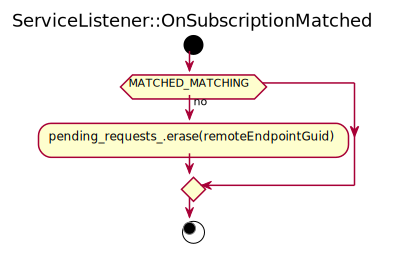
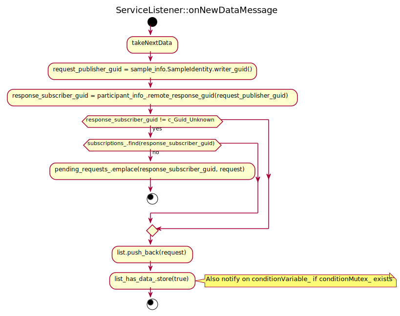
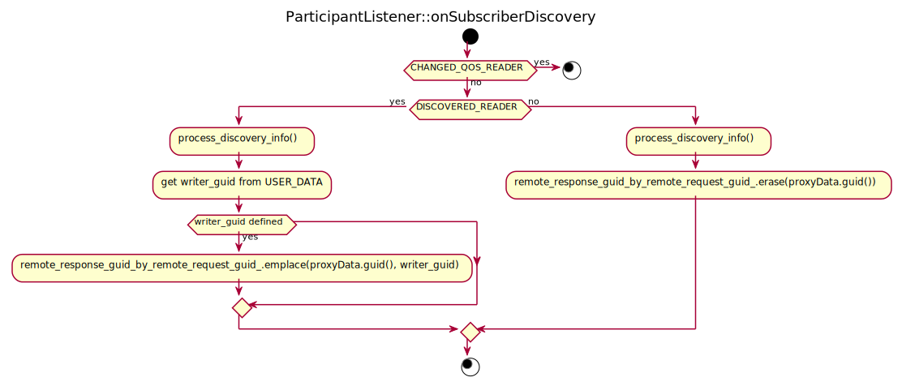
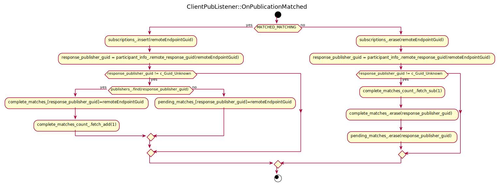
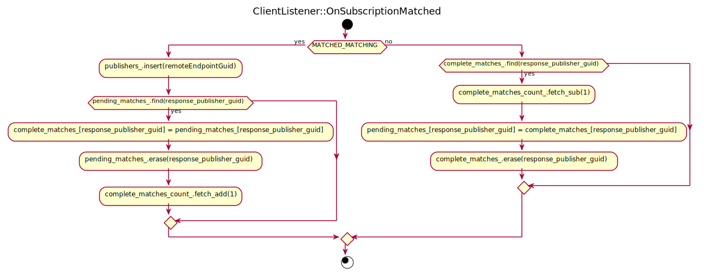
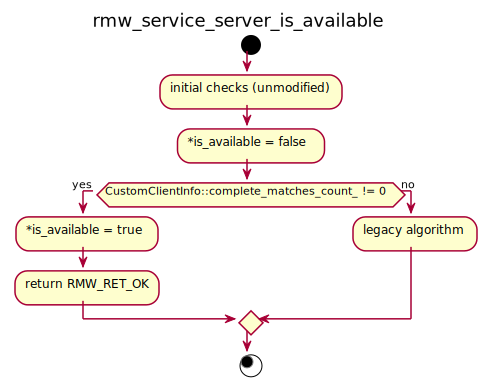

# Service discovery #

## Overview ##

The Service Mapping relies on the built-in discovery service provided by DDS. However, this discovery is not robust and discovery race conditions can occur, resulting in service replies being lost. The reason is that the request and reply topics are independent at DDS level, meaning that they are matched independently. Therefore, it is possible that the request topic entities are matched while the response entities are not fully matched yet. In this situation, if the client makes a request, the response will be lost.

On the client side this is partially solved checking the result of method `rmw_service_server_is_available` before sending any request. However, current implementation only checks that the request publisher and resonse subscribers are matched to any remote endpoint, but not that these remote endpoints correspond to the same servers. That is, the request publisher could be matched to one server ant the response subsciber to another one, so that any request will still be missing its response.

On the server side a workaround was implemented, which relies on blocking the `rmw_send_response`, and a non-standard (ab)use of the related sample identity data field (see pull request [#390](https://github.com/ros2/rmw_fastrtps/pull/390)).

A design is needed to overcome these limitations on the service discovery.

### General description of the solution ###

The client will create the response subscriber before the request publisher. When creating the request publisher, it will insert the response subscriber's GUID on the `USER_DATA` of the publisher, so that the server can know both remote endoints belong to the same client.

On the server, each time a new request is received, and already knowing which is the GUID of the response subscriber that corresponds to the publisher of the request, it checks if such subscriber has already been matched. If so, the request is processed as usual. Else, the request is held back until the subscriber is matched.
Whenever a response subscriber is matched, the list of pending requests is checked looking for requests corresponding to that client, and sent to processing.

The solution is quite symmetrical the other way round. The server creates the response publisher before the request subscriber. When creating the request subscriber, it will insert the response publisher's GUID on the `USER_DATA` of the subscriber, so that the client can know both remote endoints belong to the same server.

On the client, whenever a request subscriber is matched, it checks if the corresponding response publisher has already been matched. If so, the server's <publisher_guid, subscriber_guid> is added to a list of fully-matched servers. Else, it is added to a list of half-matched servers.
Whenever a response publisher is matched, the list of half-matched servers is checked, and if it is found there, it is moved to the fully-matched list.

#### Caveats ####

* Un-matching of endpoints has to deal with the new internal structures to maintain coherence. For example, removing the server guids from the fully-matched list and possibly moving it to the half-matched list, or cleaning the list of pending requests.
* The algorithm has to be able support remote endpoints that do not add the response GUID on the `USER_DATA`. This is to keep compatibility with older versions and other vendors. In these cases, legacy behavior is acceptable.

#### Note on the GUID format on the USER_DATA ####

At the moment, the `USER_DATA` is not being used on the RMW endpoints. We can simply add the GUID in text form using `operator<<` and `operator>>` to read and write.

In order be able to add other information on the `USER_DATA` on the future, we must *tag* the information somehow. The proposed format is:

```
  responseGUID:<GUID>
```

where `responseGUID:` is a string literal and `<GUID>` is the char string form of the GUID of the related endpoint, as formatted by `operator<<`.

Using `properties` instead of `USER_DATA` would be preferable in this case, but unfortunately `properties` are not available at publisher/subscriber level on Fast DDS at this moment.

## Class diagram ##

The following class diagram only shows classes modified by this solution. And for those classes, only added members (`+`), modified (`~`) or removed (`-`) members are shown.



## Server side ##

On the server side the general idea is to hold the incoming requests until the response publisher has matched with the response subscriber **that corresponds to the request publisher** sending the request.
That is, the request will not be notified to the upper layer until the response channel is fully established.

When a new request publisher is discovered, the GUID of the corresponding response subscriber is taken from the `USER_DATA` and the mapping between the request publisher and response subscriber is stored.
Also, when creating the request subscriber, the response publisher's GUID is added to the `USER_DATA` for the client to be able to make the connection between them.

### rmw_create_service ###

This method creates the request subscriber first and the response publisher afterwards.
The order of the creations must be inverted, so that we can get the publisher's GUID and store it on the `USER_DATA` on the `subscriberParam` before creating the subscriber.

### CustomParticipantInfo ###

* Add `remote_response_guid_by_remote_request_guid_` to hold the relation between a request publisher and its corresponding response subscriber.
  It will be an unordered map with the request publisher GUID as key:
  `std::unordered_map<eprosima::fastrtps::rtps::GUID_t, eprosima::fastrtps::rtps::GUID_t, rmw_fastrtps_shared_cpp::hash_fastrtps_guid>`

* Add method `remote_response_guid` to retrieve the content of `remote_response_guid_by_remote_request_guid_` given the GUID of a request endpoint. If the given GUID is not among the keys of the map, it returns `c_Guid_Unknown`.



### ParticipantListener::constructor ###

The constructor needs to be modified to accept a `CustomParticipantInfo` parameter, for the listener callbacks to have access to the `remote_response_guid_by_remote_request_guid_`.

### ParticipantListener::onPublisherDiscovery ###

* When a new publisher is discovered, read the `USER_DATA` to get the corresponding response subcriber's GUID and store the relation on the `remote_response_guid_by_remote_request_guid_` map.
* If the `USER_DATA` dos not contain a GUID, **do not add an entry to the map**. This signals that the remote endpoint is not compiant with these modifications (for backwards compatibility and with other vendors).
* When a publisher is un-discovered, remove the entry from the `remote_response_guid_by_remote_request_guid_` map (if any).



### CustomServiceInfo ###

* Add a reference to CustomParticipantInfo, to be able to retrieve the relations between the incoming request and the subscriber that will be receiving the response.
* Add `pending_requests_` to hold the requests that are waiting for their response channels to be ready. It will be an unordered multimap with the client response subscriber's GUID as key:
  `std::unordered_multimap<eprosima::fastrtps::rtps::GUID_t, CustomServiceRequest, rmw_fastrtps_shared_cpp::hash_fastrtps_guid>`

### ServiceListener::OnPublicationMatched ###

* When the response publisher is matched, the pending requests originating from the matched client (if any) are made available to the user.



### ServiceListener::OnSubscriptionMatched ###

* When the request subscriber is unmatched, it discards any pending requests originating from the unmatched client.



### ServicePubListener::constructor ###

The constructor needs to be modified to accept a `CustomServiceInfo` parameter, for the listener callbacks to have access to the `pending_requests_` and `remote_response_guid_by_remote_request_guid_`.

### ServicePubListener::onNewDataMessage ###

* If the response publisher is matched against the client making the request, the request is made available to the user.
* If the response publisher is not matched against the client making the request, the request is stored in the pending requests map, waiting for the match to occur.
* In the case where `remote_response_guid_by_remote_request_guid_` has no information about the remote endpoint, it means that the client does not implement this solution. We revert to legacy behavior and make the request available to the user.



## Client side ##

On the client side the issue is for `rmw_service_server_is_available` to return `true` only when the request publisher and response subscriber have matched their counterparts **on the same server**.
The idea is basically the same as with the server side, but instead of holding back messages, the logic keeps track of half-matched and full-matched servers to calculate the return of `rmw_service_server_is_available`.

As with the server side, when a new request subscriber is discovered, the GUID of the corresponding response publisher is taken from the `USER_DATA` and the mapping between the request subscriber and response publisher is stored.
Also, when creating the request publisher, the response subscriber's GUID is added to the `USER_DATA` for the server to be able to make the connection between them.

### rmw_create_client ###

This method already creates the response subscriber first and the request publisher afterwards. The only required change is to get the subscriber's GUID and store it on the `USER_DATA` on the `publisherParam` before creating the publisher.

### CustomParticipantInfo ###

* Add `remote_response_guid_by_remote_request_guid_` to hold the relation between a request subscriber and its corresponding response publisher.
  It will be an unordered map with the request subscriber GUID as key:
  `std::unordered_map<eprosima::fastrtps::rtps::GUID_t, eprosima::fastrtps::rtps::GUID_t, rmw_fastrtps_shared_cpp::hash_fastrtps_guid>`

  **Note:** This is the same object as before, it will be reused in both the client and server sides.

### ParticipantListener::onSubscriberDiscovery ###

* When a new subscriber is discovered, read the `USER_DATA` to get the corresponding response publisher's GUID and store the relation on the `remote_response_guid_by_remote_request_guid_` map.
* If the `USER_DATA` does not contain a GUID, **do not add an entry to the map**. This signals that the remote endpoint is not compiant with these modifications (for backwards compatibility and with other vendors).
* When a subscriber is un-discovered, remove the entry from the `remote_response_guid_by_remote_request_guid_` map (if any).



### CustomClientInfo ###

* Add a reference to CustomParticipantInfo, to be able to retrieve the relations between the incoming request and the subscriber that will be receiving the response.

* Add `pending_matches_` to keep track of cases where the request publisher has matched with the server but the response subscriber has not. It will be an unordered map with the server response publisher's GUID as key:
  `std::unordered_map<eprosima::fastrtps::rtps::GUID_t, eprosima::fastrtps::rtps::GUID_t, rmw_fastrtps_shared_cpp::hash_fastrtps_guid>`

* Add `complete_matches_` to keep track of fully matched servers. It will be an unordered map with the server response publisher's GUID as key:
  `std::unordered_map<eprosima::fastrtps::rtps::GUID_t, eprosima::fastrtps::rtps::GUID_t, rmw_fastrtps_shared_cpp::hash_fastrtps_guid>`

* Add `complete_matches_count_` to hold the size of `complete_matches_`, to be used on `rmw_service_server_is_available`. It will be an atomic variable `std::atomic_size_t`.

### ClientPubListener::OnPublicationMatched ###

* When a request subscriber is found, if the response subscriber is matched against the server whose subscriber we just found, add the server's publisher/subscriber pair to the `complete_matches_` map. Else, add it to the `pending_matches_` map.
* In the case of an unmatch, remove the pair for both `pending_matches_` and `complete_matches_`. Note that having only the response subscriber matched is not being tracked as pending match, as this will be resolved by the algorithm either when the response subscriber is unmatched or when the request publisher is matched again.
* All these modifications only have to be applied when the relation between server's GUIDs are present in `remote_response_guid_by_remote_request_guid_`. If the matched subscriber's GUID is not there, it means that the server does not implement this solution and legacy behavior has to be applied.



### ClientListener::OnSubscriptionMatched ###

* When a response publisher is found, if the remote GUID is found on `pending_matches_`, we are about to complete the discovery for the response topic. Remove the entry from `pending_matches_` and move it to `complete_matches_`.
* In the case of an unmatch, if the remote GUID is found on `complete_matches_`, we are about to have a half-discovery for the response topic. Remove the entry from `complete_matches_` and move it to `pending_matches_`.
* Note that having only the response subscriber matched is not being tracked as pending match, so:
  * In the case of a match, if the remote GUID is not on `pending_matches_`, it means that either the request subscriber is still umatched or that the remote server does not implement this solution. In either case there is nothing to do.
  * In the case of an unmatch, if the remote GUID is not on `complete_matches_`, it means that either the request subscriber is umatched and we are about to complete the un-discovery or that the remote server does not implement this solution. In either case there is nothing to do.



#### rmw_service_server_is_available ####

* If the `complete_matches_` map contains elements, there is at least one server fully matched.
* Else, either there is none fully matched or there are matched server that do not implement this solution. Just in case, we revert to legacy behavior, checking the number of remote and local endpoints, but without ensuring they match with each other.


